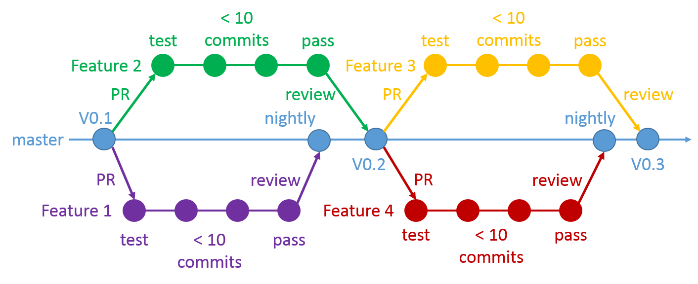

# Agenda
1. [What is FOSS?](#free-and-open-source-software-foss-or-oss)
2. [Why contribute to FOSS?](#the-importance-of-contributing-to-open-source)
3. [Different ways to participate](#ways-to-contribute)
4. [Nuts and bolts](#using-github-for-open-source-projects)

## Free and Open Source Software, FOSS or OSS
There are many definitions of "open source software" and even different names like ["free and open source software"](https://en.wikipedia.org/wiki/Free_and_open-source_software).

A Wikipedia post on [open source software](https://en.wikipedia.org/wiki/Open-source_software) says the following:
>Open-source software (OSS) is computer software with its source code made available with a license in which the copyright
>holder provides the rights to study, change, and distribute the software to anyone and for any purpose. Open-source software
>may be developed in a collaborative public manner. According to scientists who studied it, open-source software is a prominent
>example of open collaboration.[2] The term is often written without a hyphen as "open source software".

GitHub's [Open Source Guide](https://opensource.guide/) by Nadia Eghbal answers the question: [What does “open source” mean?](https://opensource.guide/starting-a-project/#what-does-open-source-mean) in a section called: [Starting an Open Source Project](https://opensource.guide/starting-a-project/).
>When a project is open source, that means anybody can view, use, modify, and distribute your
>project for any purpose. These permissions are enforced through an open source license.

For more rigor check out the the [Open Source Initiative (OSI) definition](https://opensource.org/osd), but the bottom line is that open
source code is _free_, as in **free beer**.

## The importance of contributing to open source
Why do people create open source software? [GitHub's open source guide says, "There are many reasons"](https://opensource.guide/starting-a-project/#why-do-people-open-source-their-work):
> * Collaboration: "Open source projects can accept changes from anybody in the world."
> * Adoption: "Open source projects can be used by anyone for nearly any purpose. People can even use it to build other things."
> * Transparency: "Anyone can inspect an open source project for errors or inconsistencies."

Wikipedia discusses the ["open source development model: advangtages and disadvantages"](https://en.wikipedia.org/wiki/Open-source_software#Advantages_and_disadvantages) (emphasis mine):
> * "Open source software is usually easier to obtain than proprietary software, often resulting in **increased use**."
> * "Open source development offers the potential for a **more flexible technology and quicker innovation**."

The [OSI](https://opensource.org/) lists their reasons too (emphasis mine):
> * Developers: "Open source projects provide tremendous opportunities for developers to **share and learn through collaboration**."
> * Business: "... enterprises have realized the promise of open source: **higher quality, greater reliability, more flexibility, lower cost** ..."
> * Non-Profit: "... open source ethos of contribution & community helps make life for NPO & NGO staffers easier"

Google has also recently published their [open souce guidelines](https://opensource.google.com/docs/why/).

## Ways to contribute
There are many ways to find and contribute to open source. Here are a few ...

1. [Open Source Fridays by GitHub](https://opensourcefriday.com/)
2. [GitHub's Open Source Guide by Nadia Eghbal](https://opensource.guide/)
3. [Hacktoberfest sponsored by Digital Ocean](https://hacktoberfest.digitalocean.com/)
4. [GitHub](https://github.com/open-source)

## Using GitHub for Open Source projects
GitHub is an ideal tool for open source projects for many reasons. It's free for open source projects. The issue, pull request and 
review tools make contributing to open source much easier. And other tools like a wiki, issue or pull request templates, and automatic 
detection of licenses, contribution guidelines, and codes of conduct are also very useful.

### The license
Whether you are using, creating or contributing to open source, it's useful to have a basic understanding of licenses.
[According to OSI there at least 9 common licenses.](https://opensource.org/licenses) GitHub created 
[choose a license](https://choosealicense.com/) to help users choose and create a license. There are even 
[licenses for works of art and prose by Creative Commons](https://creativecommons.org/) for use in blogs and other online creations that 
aren't necessarily computer code.

### Code of Conduct and Contribution Guidelines
You want to read these and follow them.

### Issues
One of the easiest ways to contribute to open source is to create an issue. Issues can be technical, code-related or an improvement to 
the documentation. There is no issue too big or too small, and never any dumb questions, only dumb answers. However try to empathize 
with the other users and maintainers when reporting issues. They may be overwhelmed by a deluge of issues, and they are typically 
volunteering their precious free time. So a little preparation or ground work before submitting an issue will go a long way to getting 
the issue resolved.

1. Try to solve the issue yourself. Spend a reasonable amount of time on this to show that you've done your research.

    * Check if the open source project has a [Google group](https://groups.google.com/) or a Slack or IRC channel and
      search for common questions or issues you have. Ask for help from the forum.
    * Ditto for [StackOverflow](https://stackoverflow.com/).

2. If there are submission guidelines or an issue template, read and follow it very carefully, complete all sections as thoroughly
   as possible.

    * Include in your issue something that approaches a [minimum complete verifiable example](https://stackoverflow.com/help/mcve) of 
      your issue.
    * It should go without saying, but be polite, respectful and constructive. [Assume Good Faith](https://opensource.org/node/877)

3. Scratch your own itch. Follow your issue with a [pull request](#pull-requests).

### Pull Requests
[Pull requests (PR's)](https://help.github.com/articles/about-pull-requests/) are one of the most useful keys to contributing to open 
source. With a few exceptions, PR's are how most open source projects receive contributions. A PR is not a Git feature; a PR is a 
feature of GitHub and other online hosted repositories. A PR is defined by GitHub as follows:

>Pull requests let you tell others about changes you've pushed to a repository on GitHub. Once a pull request is opened, you can
>discuss and review the potential changes with collaborators and add follow-up commits before the changes are merged into the
>repository.

I wrote a [blog post called winning workflow](http://poquitopicante.blogspot.com/2016/10/winning-workflow.html) about how we use PR's in my team to collaborate.

#### Step 1: Fork the repository
The first step in contributing to an open source project should be to [fork the repository](https://help.github.com/articles/fork-a-repo/). [Forking a repository](https://guides.github.com/activities/forking/) allows you to create pull requests for your contributions. From the main GitHub page for the project find the fork button and select your personal GitHub profile as the location for your fork.

#### Step 1-1/2: The shortcut
You can work, commit and submit a PR directly from GitHub by editting and creating new files directly in GitHub online. Make sure to select that you want GitHub to create a new branch and submit your PR when you commit your work.

>Create a new branch for this commit and start a pull request.

Then for future commits you would commit directly to the "patch-N" branch created by GitHub for your pull request.

>Commit directly to the `patch-1` branch.

In fact this is exactly the shortcut I'm using to edit this file. However there are some limitations to this approach. You may not be able to upload images this way, but you can start with this shortcut and then continue with the remaining steps anytime.

#### Step 2: Clone your fork
The second step is to [use Git to clone](https://git-scm.com/docs/git-clone) the fork you just created from GitHub.

    me@mycomputer ~/projects
    $ git clone git@github.com:me/oss-proj-fork.git  # your url might be https://github.com/me/oss-proj-fork.git

This copies the repository to your computer where you can work on it.

#### Step 3: Add "Upstream" Git Remote
The third step is to [add a Git remote ](https://git-scm.com/docs/git-remote) to the original open source project which you forked on GitHub. For convenience sake we'll call this the "upstream" repository, but call it whatever you want.

    me@mycomputer ~/projects/oss-proj-fork (master)
    $ git remote add upstream git@github.com:oss-people/oss-proj.git  # your url might be https://github.com/oss-people/oss-proj.git

#### Step 4: Make a feature branch
The fourth step is to [checkout a new feature branch](https://git-scm.com/docs/git-checkout#git-checkout-emgitcheckoutem-b-Bltnewbranchgtltstartpointgt). This is a short lived branch with a descriptive name and it is the easiest path to submitting a PR beacuse it has several advantages.

    me@mycomputer ~/projects/oss-proj-fork (master)
    $ git checkout -b my-feature-gh99  # put the issue number if there is one

* Your branch name serves as a quick description of the feature or issue.
* It's easier to sync your feature branch with master if your feature takes awhile to finish, and other features get merged upstream before you're done.
* If the upstream project chooses to rebase and squash your work into a single commit, your feature branch can serve as a history of the changes you made, although typically after a PR is merged, the feature branch can be deleted.

#### Step 5: Make a test
The fifth step is to make a test using the unittest framework that the upstream repository uses. This test serves as the minimum acceptance criteria for the new feature. Testing in code development is **very** important. Tests ensure that a project is working as intended, and when issues arise, tells the maintainers and contributors, exactly where the problem is. Often repositories are integrated with online build and test servers called "continuous integration" or CI, that test every PR commit. These are helpful for communicating to collaborators the state of the PR.

There are several established unittest frameworks, including [Python's own builtin Unittest module](https://docs.python.org/3/library/unittest.html) however most project use either [nose](http://nose.readthedocs.io/en/latest/) or [pytest](https://docs.pytest.org/en/latest/). If you can't figure what the maintainers use, then use pytest and simple assertions. Don't be surprised if they ask you to adopt their own specific paradigm. Be flexible. This is an opportunity for you to collaborate with the maintainer and learn something new.

    from oss_proj.core.new_feature import new_calc
    import numpy as np
    import pandas as pd
    import os

    BASEDIR = os.path.dirname(__file__)
    NEW_FEAT_TEST_DATA = os.path.join(
        BASE_DIR, "new_feature_test_data.csv"
    )
    A, B, C = 1, 2, 3
    KNOWN_GOOD_VALUES = pd.read_csv(NEW_FEAT_TEST_DATA)

    def test_new_feature_calculation():
        calculated_values = new_calc(A, B, C)
        assert np.allclose(calculated_values, KNOWN_GOOD_VALUES)

If you run the testrunner, `pytest`, from the command line now, your test will fail. Don't cry, this is OK. Failure is not bad. We will work on this until it passes, but not yet. First we have to commit our changes and push them up to our fork.

    me@mycomputer ~/projects/oss-proj-fork (my-feature-gh99)
    $ git add oss-proj-fork/oss_proj/core/new_feature.py  # we may need to add files first
    $ git commit -m "add test for new feature to fix #99"  # if there's an issue you can refer to it
    $ git push -u origin my-feature-gh99

#### Step 6: Create a Pull Request on GitHub
**Now is when you submit the PR!** Not after you've done a bunch of work and find out that someone else already solved the problem, or that the maintainers don't like your approach b/c it doesn't fit into their long term plan. But **NOW!** as soon as you start working, so that everyone else has a chance to collaborate with you and your cool new feature.

To create a PR for your feature, go online to GitHub. When you view either your fork or the upstream repo, you should see a message from GitHub that asks you if you want to create a PR for your new feature. Click it, and add some descriptive information about your plans for the feature, what you intend to do, if it relates to any issues, how long it might take, what help you need, etc. Then click submit.

If GitHub doesn't automatically ask you, go to either your fork or the upstream repo and click New Pull Request. Then choose the upstream repo as the "base fork" and set the "head fork" to your feature branch.

#### Step 7: Hack, Communicate, Repeat
Now comes the fun. Hack! Communicate via the pull request with the other contributors. Collaborate and hack some more. Finally let them know when all of your changes are complete, your tests are all passing and you're ready for the maintainers to review and merge your new feature. This may take many iterations. **Be patient!** [Assume Good Faith](https://opensource.org/node/877)

# Conclusion
That's it. There may be some nuances and differences between projects. There are some projects that want you to email patches, but that's a subject for another discussion. Also you may be asked to add or update documentation. Often there is an `AUTHORS` file for contributors, feel free to add yourself or ask if you should. Also there may be a changelog that you should contribute to. Or you may choose to contribute to the wiki instead of the codebase. Communication is the key to finding out about all of these loose ends. Keep the channels open, stay positive and enjoy.

# Cool Video
[This is a cool video of Brett Cannon](https://www.youtube.com/watch?v=y19s6vPpGXA)
