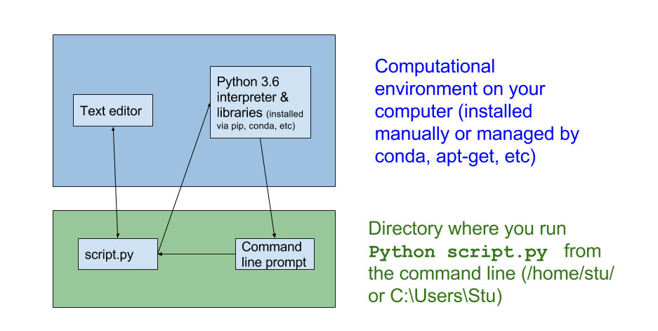
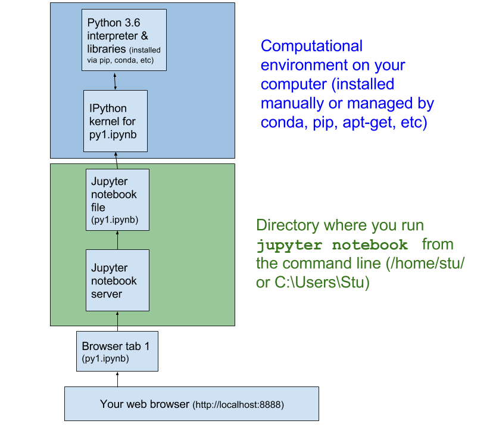
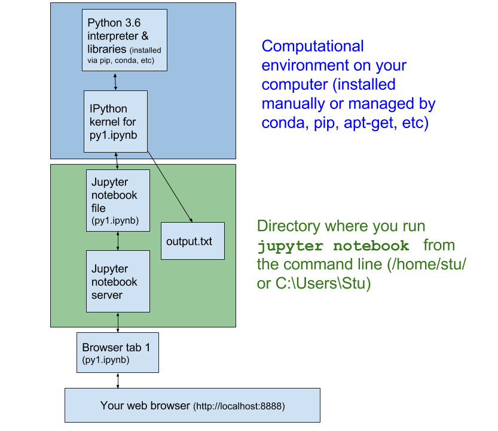
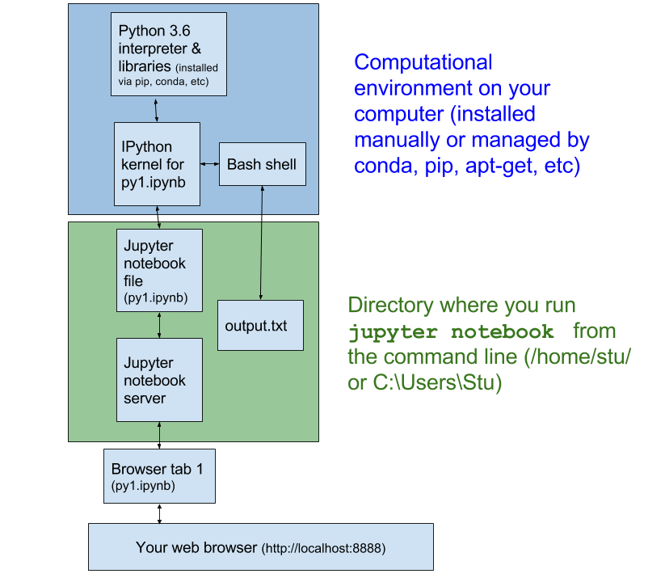
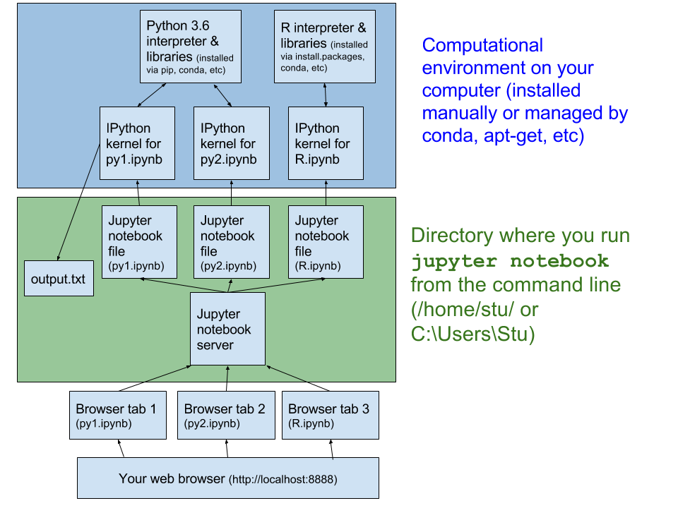
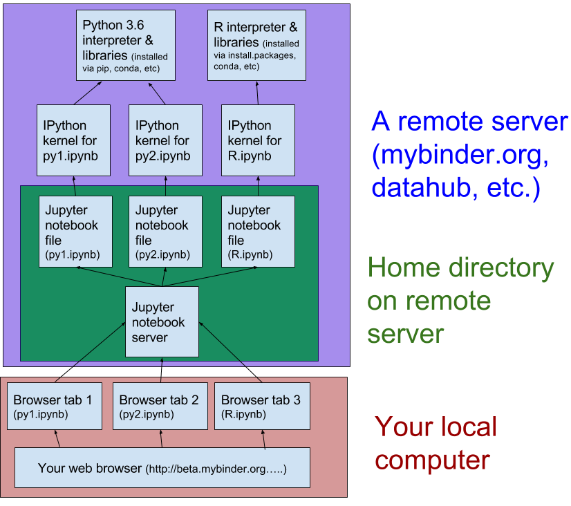

This session will be an introduction to using [Jupyter notebooks](http://jupyter.org/). No specific programming language expertise is required, although I'll show how to use Jupyter to write code in python, R, and bash. We'll walk through some of the basics together, so you can install Jupyter on your computer with [Anaconda](https://www.anaconda.com/downloads) or you can launch a temporary virtual server with [our mybinder container](https://beta.mybinder.org/repo/thehackerwithin/berkeley/tags.html).

# Some links and resources
- [Official Jupyter Documentation](https://jupyter.readthedocs.io/en/latest/)
- [Gallery of interesting Jupyter notebooks](https://github.com/jupyter/jupyter/wiki/A-gallery-of-interesting-Jupyter-Notebooks)
- [IPython magic commands](http://ipython.readthedocs.io/en/stable/interactive/magics.html)
- [IPython minibook tutorial](https://github.com/ipython-books/minibook-2nd-code)
- [Jupyter Cheat Sheet](https://s3.amazonaws.com/assets.datacamp.com/blog_assets/Jupyter_Notebook_Cheat_Sheet.pdf)
- [MyBinder.org](http://mybinder.org) -- turn any GitHub repo with notebooks into a live temporary server

# Jupyter (and Python) is a [REPL](http://enwp.org/REPL): Read-Evaluate-Print Loop

You might be familiar with a REPL -- the BASH command line is one too!

# Mapping out different uses

Note these are simplifications that aren't 100% accurate -- all models are wrong, but some are useful. 

## What you may be familiar with

## What Jupyter notebook does (on your computer)
### Basic structure

### Writing output to a file

### Reading a file with bash

### Writing output to a file

## Using many notebooks and kernels (on your computer)

## Jupyter on a remote server

