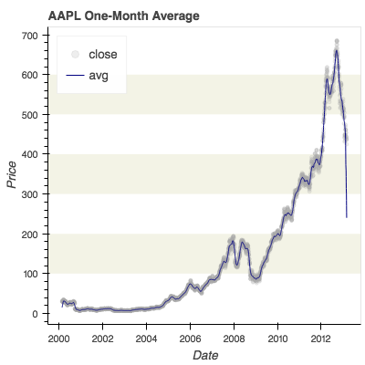
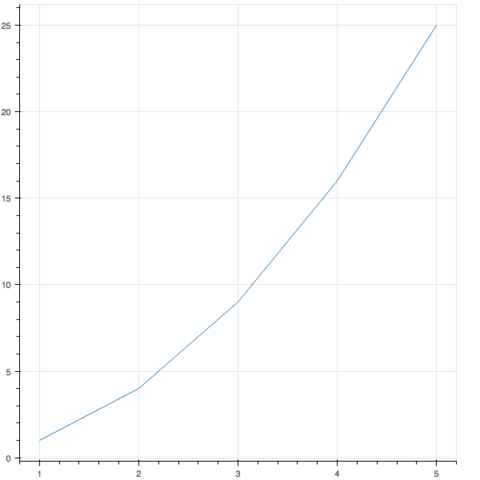

# Agenda
1. [Mini lesson on Flask apps with Bokeh plots](#mini-lesson)
2. [Mini sprint contest](#mini-sprint-contest) to develop a web app from NREL
developer API
3. [Miscellaneous odds and ends](#miscellaneous-odds-and-ends)

# Bokeh Plots

# Intro
In my opinion, an interactive web application is fun way to share an analysis.
I believe users create deeper, more meaningful connections when they explore
data interactively. The goal of this tutorial will be to teach you how to
quickly make a simple web application that you can use to share your data
analyses online.

# Requirements
You will need a laptop with Python installed for this tutorial. If you need to
install Python, please
[download Anaconda 3.6-64bits](https://www.anaconda.com/download/) before you
attend this tutorial. During the tutorial we will use the following packags, so
please install them in a new conda or virtual environment:
* [Flask](http://flask.pocoo.org/)
* [Bokeh](https://bokeh.pydata.org/)
* [Jinja2](http://jinja.pocoo.org/)
* [Requests](http://docs.python-requests.org/)

This is easiest with Anaconda:

    (root) ~/Projects/myapp $ conda create -n myvenv python==3.6.3 flask bokeh jinja2 requests
    (root) ~/Projects/myapp $ activate myvenv
    (myvenv) ~/Projects/myapp $

# Mini lesson
This mini lesson has 4 parts:
1. [Flask](#flask)
2. [Bokeh](#bokeh)
3. [Jinja2](#jinja2-templates)
4. [Bootstrap](#bootstrap)

Most of the snippets and examples from this mini-lesson are in the The Hacker
Within - Berkeley GitHub repository code examples folder
[here](https://github.com/thehackerwithin/berkeley/tree/master/code_examples/flask/).

## Flask
[Flask](http://flask.pocoo.org/) is a micro framework for developing web
applications. A web app runs in a browser. The web server can be run locally on
your laptop, or it can be on a remote server. Making a Flask app is
surprisingly easy! Copy the following into a new file and save it as
`hello.py`.

    from flask import Flask

    app = Flask(__name__)

    @app.route('/')
    def hello():
        return 'Hello World!'

    if __name__ == '__main__':
        app.run()

This creates a new `app`, that will listen and respond to the "root" url, or
`/` with the callback function `hello()`. This decorated function can be called
a "route". Now open a terminal window, browse to your app, and run it!

    (myvenv) ~/Projects/myapp/ $ python hello.py

You should see the following in your terminal:

    * Running on http://127.0.0.1:5000/ (Press CTRL+C to quit)

Open a browser and enter the url given. This url: `http://127.0.0.1` is also
called `localhost` and the second number, `5000`, is the port. You should see

>"Hello World!"

in your browser. Congratulations! You've just written your first web app! Now
hit `ctrl-c` in your terminal to kill the app.

## Bokeh
[Bokeh](https://bokeh.pydata.org/) is a Python library for making interactive
"[D3](https://d3js.org/)" style plots using a imperative style like
[Matplotlib](https://matplotlib.org/) (versus a declarative style like
[Altair](https://altair-viz.github.io/)). Bokeh is ideally suited for embedding
plots in a web app like Flask. Let's see how you can add a Bokeh plot to your
`hello.py` Flask app.

1. Make a new folder called `myapp-0/`
2. Copy your old `hello.py` into the new folder
3. Change your new `myapp-0/hello.py` file as follows:

       """
       My App 0: Hello with Bokeh plot.
       """
       from bokeh.plotting import figure
       from bokeh.resources import CDN
       from bokeh.embed import file_html
       from flask import Flask, Markup

       app = Flask(__name__)

       @app.route('/')
       def hello():
           plot = figure()
           xdata = range(1, 6)
           ydata = [x*x for x in xdata]
           plot.line(xdata, ydata)

           return Markup(file_html(plot, CDN, "my plot"))

       if __name__ == '__main__':
           app.run(debug=True)

4. Open a terminal and navigate to `myapp-0/`

       $ cd ~/path/to/myapp-0/

5. Activate your conda environment

       myapp-0/ $ source ~/miniconda/bin/activate myenv

6. Start the web app:

       (myenv) myapp-0/ $ python hello.py

7. Open a browser to http://localhost:5000/ or http://127.0.0.1:5000/ and you
should see a line plot that looks similar to this:

Bokeh gives you several interactive features for free!

* link to the Bokeh documentation
* pan, zoom, and reset
* save

8. Finally hit `ctrl-c` in your terminal to kill the app.

There are at least two ways to
["embed" a Bokeh plot in an HTML document](https://bokeh.pydata.org/en/latest/docs/user_guide/embed.html):

* [HTML files](https://bokeh.pydata.org/en/latest/docs/user_guide/embed.html#html-files):
create a stand alone HTML file
* [components](https://bokeh.pydata.org/en/latest/docs/user_guide/embed.html#components):
return the individual components used to embed the plot in any HTML file.

This example used the first method. In the next example we'll use the
"components" method to embed the plot in our own custom HTML file.

## Jinja2 Templates
[Jinja2](http://jinja.pocoo.org/) is a Python library for making HTML files
with dynamic content that is rendered using a subset of the Python language.
The Jinja2 markup is enclosed in curly-cue braces and can refer to variables
and commands:

    <!-- http://jinja.pocoo.org/docs/2.10/templates/#escaping -->
    <ul>
    
      <li><a href="{{ user.url }}">{{ user.username }}</a></li>
    
    </ul>
    

_attribution: snippet from the [Jinja2](http://jinja.pocoo.org/) documentation_

The HTML files with Jinja2 markup are called "templates". Flask can use Jinja
to render content placed in a folder called `templates` next to your app. Use
[`render_template`](http://flask.pocoo.org/docs/0.12/quickstart/#rendering-templates)
to specify the name of the template file and the desird data as keyword
arguments.

Let's modify our "Hello" app to use a custom template and Bokeh components.

1. Create a new folder called `myapp-1/` and copy the `myapp-0/hello.py` to it.
2. Create a `templates` folder inside `myapp-1/` and save the following file as
`myapp-1/templates/hello.html`:

       <!-- http://jinja.pocoo.org/docs/2.10/templates/#escaping -->
       <!DOCTYPE html>
       <html lang="en">

           <head>
               <meta charset="utf-8">
               <title>{{ title }}</title>

       <link
           href="https://cdn.pydata.org/bokeh/release/bokeh-0.12.14.min.css"
           rel="stylesheet" type="text/css">
       <link
           href="https://cdn.pydata.org/bokeh/release/bokeh-widgets-0.12.14.min.css"
           rel="stylesheet" type="text/css">
       <link
           href="https://cdn.pydata.org/bokeh/release/bokeh-tables-0.12.14.min.css"
           rel="stylesheet" type="text/css">

       
       
       

           </head>

           <body>
               <h1>Hello!</h1>
               {{ plot_div|safe }}
               {{ plot_script|safe }}
           </body>

       </html>
       

3. Now change `myapp-1/hello.py` to get the Bokeh components and render the
`hello.html` template:

       """
       My App 1: Hello with Bokeh plot and Jinja2 template.
       """
       from bokeh.plotting import figure
       from bokeh.embed import components
       from flask import Flask, request, render_template, abort, Response

       app = Flask(__name__)

       @app.route('/')
       def hello():
           plot = figure()
           plot.circle([1, 2], [3, 4])

           plot_script, plot_div = components(plot)
           kwargs = {'plot_script': plot_script, 'plot_div': plot_div}
           kwargs['title'] = 'hello'
           if request.method == 'GET':
               return render_template('hello.html', **kwargs)
           abort(404)
           abort(Response('Hello'))

       if __name__ == '__main__':
           app.run(debug=True)

4. Open a terminal, navigate to your app, activate your conda environment, and
start your app:

       $ cd ~/path/to/myapp-1/
       myapp-0/ $ source ~/miniconda/bin/activate myenv
       (myenv) myapp-1/ $ python hello.py

5. Open your browser to `localhost:5000` and you should see your app with the
title

    >Hello!

    above the plot.

In this example, we get the Bokeh components, `plot_script` and
`plot_div` and pass them to the template, `hello.html` using `render_template`.

The template must have several links and scripts to run Bokeh. These are placed
in the `<head>` section of the HTML file. [PyData](https://pydata.org/)
generously provides a content delivery network (CDN) to provide these files,
but you can also download them and host them locally. There are 3 cascading
style sheets (CSS) with custom HTML and 3 JavaScript files with scripts that
Bokeh uses to make interactive plots.

Finally the template must have a `
` element where you want the Bokeh plot
to appear, and a `<script>` which has your data and the Bokeh JavaScript code
to make your interactive plot.

## Bootstrap
[Bootstrap](https://getbootstrap.com/) is an HTML framework and component
library of CSS and JavaScript files that takes the pain out of creative
attractive content for folks who are not web designers. To use it all you have
to do is put the CSS and Javascript links in your HTML. Follow the directions
in their [getting started introduction](https://getbootstrap.com/docs/4.0/getting-started/introduction/)
to see where to put thes links.

# Mini Sprint Contest!
We're going to have a mini sprint so that you can practice what you've learned.
The goal will be to create an interactive Bokeh plot in a Flask app using data
from the NREL Developer Network.

1. Go to [NREL Developer Network](https://developer.nrel.gov/) and register for
an API key.

    

2. Start your engines.

3. Go!

See
[Flask code examples](https://github.com/thehackerwithin/berkeley/tree/master/code_examples/flask/)
for some ideas. (wip)

# Miscellaneous odds and ends
There are lot's of other rabbit holes to jump down. Here are a few.

## HTML, CSS, and JS
Understanding HTML 101 will make building your web app or generating static
content much easier. But understanding HTML is just the tip. You may quickly
find yourself dabbing in CSS and JS too. Embrace it. But beware of
misinformation - **avoid** [W3Schools](https://en.wikipedia.org/wiki/W3Schools)
and go straight to the horses mouth. Mozilla invented the internet, not Al Gore,
(_j/k_) so when if you need to find out anything about HTML, CSS, or JS, always
check the [Mozilla Developer Network (MDN)](https://developer.mozilla.org/en-US/)
first!

## Other HTML/CSS/JS frameworks
Writing your own CSS and JS is tiring. Making it look good, unless you're a
pro, is nearly impossible. These frameworks make it easy to look like a pro.
* [Bootstrap](https://getbootstrap.com/)
* [React.js](https://reactjs.org/)

## Static content
If you only need to generate your report once, or only occasionally, then a
static site is fine. Your plots can still be interactive, static just means
that the content on the site doesn't change. A static site generator creates
HTML, CSS, and JS content from some other markup like Markdown or ReST. Some
hosts also offer static site generation and content management. And there are
some tools that can generate static content in the form of HTML even though
that's not their primary function.
* [GitHub Pages](https://pages.github.com/) and [Jekyll](https://jekyllrb.com/)
* [Pelican](http://docs.getpelican.com/en/stable/)
* [Sphinx](http://www.sphinx-doc.org/en/master/)
* [Jupyter](http://jupyter.org/)
* [Markdown](https://en.wikipedia.org/wiki/Markdown)
* [HTML/CSS/JS](https://developer.mozilla.org/en-US/)
* [Bokeh](https://bokeh.pydata.org/en/latest/), [d3](https://d3js.org/),
[Vega](https://vega.github.io/vega/), and
[Vega-Lite](https://vega.github.io/vega-lite/)
* [Blogger](https://www.blogger.com), [WordPress](https://wordpress.org/), and
[WordPress.com](https://wordpress.com/) for hosting

## Web frameworks for dynamic content
If your site depends on user input or if you want your site to update
automatically with input from another source like an API or database, then you
will need to use a web framework and a web server. A web framework combines the
most common features from most web applications into a boilerplate design.
Additional features can usually be added with extensions and plugins. Some
frameworks are simpler than others, and some come with everything included.
* [Flask](http://flask.pocoo.org/)
* [Django](https://www.djangoproject.com/)
* [Angular](https://angularjs.org/)

## AJAX
There is this crazy middle ground between static and dynamic content where you
get content and modify the DOM using AJAX directly from the browser. This is
way beyond the scope of this tutorial.

## Web API
This is a web app that has a published interface or schema that users can use
to programmatically interact with the application without a browser. There are
serveral frameworks extensions that can be used to create a web API.
* [Django REST Framework](http://www.django-rest-framework.org/)
* [TastyPie](https://django-tastypie.readthedocs.io/en/latest/)
* [Flask RESTful](https://flask-restful.readthedocs.io/en/latest/)
* [Flask API](https://www.flaskapi.org/)

## Embedded ploting libraries
* [Bokeh](https://bokeh.pydata.org/en/latest/)
* [Plot.ly](https://plot.ly/)
* [d3](https://d3js.org/)
* [Vega](https://vega.github.io/vega/) and
[Vega-Lite](https://vega.github.io/vega-lite/)
* [Chaco](http://docs.enthought.com/chaco/)
* [Matplotlib](https://matplotlib.org/) - static only AFAIK
* [mpld3](http://mpld3.github.io/)

## Database object relational mapper (ORM)
If your web interacts with a database, then you should use an object relational
mapper. This tool converts native objects into database records and generates
database operations like SQL queries from native methods in the background,
making it simpler to create, read, update, and destroy data.
* [SQL Alchemy](http://www.sqlalchemy.org/)
* [Django](https://www.djangoproject.com/)

## Hosting
If you want to share your site, or have it visible outside of your network then
you'll need a host. Beware, once your data is public it's on you to keep it
secure. Web frameworks will handle the most obvious threats, but you still need
to use common sense. Robots continuously crawl the internet and automatically
attack anything new that they find, regardless of how insignificant it is.
>**Warning**: *If your application will require authentication, then you must
>use HTTPS!*

* [Heroku](https://www.heroku.com/)
* [AWS](https://aws.amazon.com/)
* [Google App Engine](https://cloud.google.com/appengine/)
* [Azure](https://azure.microsoft.com/en-us/)
* local network or intranet

## Web servers
Hopefully, you probably won't have to deal with setting up a web server, since
this is usually handled by your hosting service, but it's useful to know about
web servers at a high level. Typically you will see a WSGI server, WSGI is a
protocol for passing content to and from Python, and a web server that offers
the content to web browsers requesting it and accepts content from browsers
that send it. Most WSGI servers combine both of these but a dedicated web
server can offer more features and better performance. It's not uncommon for a
single web app to be simultaenously running on several web servers and several
WSGI servers behind a single load balancer that also offers a CA-certificate
and port forwarding from HTTP (port 80) to HTTPS (port 443) to secure your
site.
* [Apache](https://httpd.apache.org/) + [mod-wsgi](https://modwsgi.readthedocs.io/en/develop/)
* [gunicorn](http://gunicorn.org/) or [uwsgi](https://uwsgi-docs.readthedocs.io/en/latest/)
* [nginx](https://www.nginx.com/) + gunicorn|uwsgi
* [Werkzeug](http://werkzeug.pocoo.org/)
* [Tornado](http://www.tornadoweb.org/en/stable/)

## REST
In order for your application to run on several servers simultaneously, it
needs to be RESTful. REST stands for representational state transfer and
basically means that your app is stateless. In other words all of the
information that the servers need to run your app is contained one of three (or
maybe four) places:
* request header
* query string
* URL
* (maybe a cookie or other client side cache that is used for client side operations only, eg: with JavaScript)

## Glossary
* DOM = [document object model](https://en.wikipedia.org/wiki/Document_Object_Model)
* HTML = [hypertext markup language](https://en.wikipedia.org/wiki/HTML)
* CSS = [cascading style sheets](https://en.wikipedia.org/wiki/Cascading_Style_Sheets)
* JS = [JavaScript](https://en.wikipedia.org/wiki/JavaScript) - it has **nothing** to do with Java, used to manipulate the DOM from the browser.
* REST = [representational state transfer](https://en.wikipedia.org/wiki/Representational_state_transfer)
* URL/URI = [universal resource locator](https://en.wikipedia.org/wiki/URL)/[identifier](https://en.wikipedia.org/wiki/Uniform_Resource_Identifier)
* HTTP = [hypertext transfer protocol](https://en.wikipedia.org/wiki/Hypertext_Transfer_Protocol)
* HTTPS = [with SSL or TLS](https://en.wikipedia.org/wiki/HTTPS)
* SSL = [secure socket layer](https://en.wikipedia.org/wiki/Transport_Layer_Security) was replaced by TLS
* TLS = [transport layer security](https://en.wikipedia.org/wiki/Transport_Layer_Security)
* WSGI = [web server gateway interface](https://en.wikipedia.org/wiki/Web_Server_Gateway_Interface)
* ORM = [object relational mapping](https://en.wikipedia.org/wiki/Object-relational_mapping)
* MVC/MVW = [model-view-controller or model-view-whatever](https://en.wikipedia.org/wiki/Model%E2%80%93view%E2%80%93controller)
* SQL = [structured query language](https://en.wikipedia.org/wiki/SQL)
* API = [application programming interface](https://en.wikipedia.org/wiki/Application_programming_interface)
* AJAX = [asynchronous JavaScript and XML](https://en.wikipedia.org/wiki/Ajax_(programming)) - used for client side requests
* CORS = [cross-origin resource sharing](https://en.wikipedia.org/wiki/Cross-origin_resource_sharing)
* CRSF = [cross-site request forgery](https://en.wikipedia.org/wiki/Cross-site_request_forgery)
* JSON = [JavaScript object notation](https://en.wikipedia.org/wiki/JSON)
* XML = [extensible markup language](https://en.wikipedia.org/wiki/XML)
