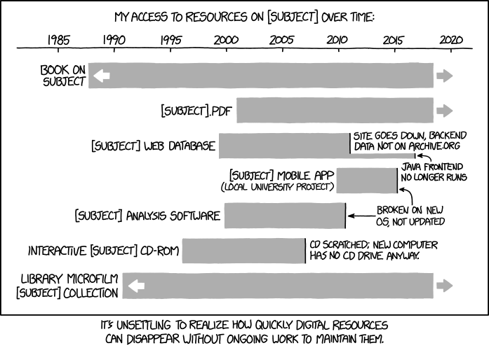

# Welcome!

# Speakers

Joshua Quan - Data Librarian @ UC Berkeley Library, D-Lab

# Content

This DATS session will introduce archival data repositories researchers might be interested in using to discover datasets or depositing their own data and code
for long-term archiving for others to discover. We will cover Dataverse, Dash/Dryad, and Zenodo.

### Objectives:

- WTF is a Repository and why are there so many?
- Why sharing data is easier with a Repository designed for archiving and discovery
- Know a little something about: Dataverse, Zenodo, Dash/Dryad, OSF, ICPSR, Github
- Searching for Data in Repositories
- APIs + Tools to work with repositories

## Data Repository Defined

From [Registry of Research Data Repositories](https://www.re3data.org/):
"subtype of a sustainable information infrastructure which provides **long-term storage** and **access** to research data that is the basis for a scholarly publication. Research data means information objects generated by scholarly projects for example through experiments, measurements, surveys or interviews."

...So it's a place to put your data and analysis scripts that will be accessible beyond the life of a research project, grant, or individual career.

## Things to Consider

#### Reputation

- Is the repository endorsed by a funding agency, scholarly journal, professional society, library, etc?
- Is it listed in the [Registry of Research Data Repositories](https://www.re3data.org/)?

#### Sustainability

- Is there evidence that the repository will be around in Five years? Ten years?

- Is the owner/manager of the content reliable?

#### Visibility

- One of the primary reasons to deposit your data in a repository is to obtain a unique identifier that others can use to cite your data. This service will increase the visibility of your data within the scholarly literature and allows researchers to find it later on. 

- Ensure your data repository offers a DOI (digital object identifier), handle, or another unique indentifer.

#### Usability

- The usability of a data repository is also important in ensuring that others will be able to access your data. If your peers are unable to find and download your data it will limit the effectiveness of sharing your data. 

- A usable data repository should allow for users to easily upload, download, and cite data sets.

#### Features

- Some data repositories have really great features like integrations with Open Science Framework, GitHub, or other commercial storage solutions. While these feature may not be the keystones to providing long-term access to your data, they can help you share your data more frequently and effectively

- [Comparative Overview of Features](https://dataverse.org/blog/comparative-review-various-data-repositories)

- You’ll want to review the upload and storage limits. Some repositories offer limited free storage before a fee is charged. Be sure to look over each data repository’s features and compare them with comparable services.

#### Formats

- Be sure to take a look at the repositories documentation to ensure they can store the data you’ve generated

- Does the repository provide a way to preview data/scripts? i.e., ipynb in Github

#### Rights

- Take time out to read the terms of use and to understand what permissions you’re giving the data repository.

- For instance, does your data repository use common licensing agreements ([Creative Commons](https://creativecommons.org/)) that will help others understand what they can and cannot do with your data?

## General vs. Subject Specific Repositories

- A “general” data repository is subject independent and will have data from many fields. General data repositories are often well-known solutions with large user communities. 

- General repositories are great places to store all your data because they tend to have robust features (like simple GitHub integration), strong institutional backing, and are indexed by search engines.

- The downside of general repositories is that because there is a lot of everything, users might have more difficulty finding your work.

### General repositories

- [Harvard Dataverse](https://dataverse.harvard.edu/): Harvard’s Dataverse is both a [platform](http://dataverse.org/) for institutions and a data repository. Backed and developed by Harvard’s IQSS, Libraries, and Information Technology, Dataverse has 22 installations with over 48,000 datasets, and 2 million downloads.

- [UC Dash](https://dash.berkeley.edu/stash) is an open-source, self-service toolkit for managing, openly publishing, and effectively describing data for access and reuse. Dash features geolocation metadata, ORCID, DOI, and FundRef identifiers, and generates a citation for all of your datasets. Additionally, Dash allows you to set a timed-release of data while undergoing peer-review.

- [Zenodo](https://zenodo.org/): Funded by [CERN](http://home.cern/), [OpenAIRE](https://www.openaire.eu/), and [Horizon 2020](https://ec.europa.eu/programmes/horizon2020/)
  - Zenodo accepts [50GB per dataset](https://zenodo.org/faq) and [integrates nicely with GitHub](https://guides.github.com/activities/citable-code/). While Zenodo doens’t seem to detail its download numbers like other services, it is partnered with CERN, which stores more than 100PB (petabytes) of data.
  - Starting to archive some of the lessons/modules created in the [Division of Data Sciences](https://zenodo.org/communities/berkeley-data-sciences/)

### Subject repositories

- Many subject-specific data repositories exist today. Unlike a general data repository, discipline-based repositories can be very specific and well-known within a particular field. This can be both a good thing and a bad thing.

- Pro: If your field has a specific repository you’re data will likely be seen by the right people - increasing its chance for reuse and further influence

- Con: Researchers outside of that discipline might not know where to look for your data

- [Re3data.org](http://www.re3data.org/): The Registry of Resarch Data Repositories is a service provided by DataCite (a global non-profit that provides DOIs - Digial Object Identifiers). With over 1,500 data repositories listed, re3data.org is likely to have a repository in your discipline.

- [OpenDOAR](http://opendoar.org/): OpenDOAR (Directory of Open Access Repositories) is an curated and authorative list of academic open access repositories. Not only do staff of OpenDOAR visit each repository listed but they also review each repository for quality (a pretty big task considering they have 2,600 listings). Included in OpenDOAR are datasets, articles, books, and software.

- Simmons College hosts the [Open Access Directory’s list of Data Repositories](http://oad.simmons.edu/oadwiki/Data_repositories). The Open Access Directory is maintained by the Open Access community and an editorial board. It includes repositories ranging from archaeology to physics.

## APIs + Wrappers

[Zenodo(R)](https://github.com/karthik/zenodo)  
[PyZenodo(Python)](https://github.com/Tommos0/pyzenodo)

[Dataverse(R)](https://cran.r-project.org/web/packages/dataverse/index.html)  
[Dataverse-client(Python)](https://github.com/IQSS/dataverse-client-python)

[Github Search API](https://developer.github.com/v3/search/)

## Dataverse Walk-through

- Searching and using the [website/GUI](https://dataverse.harvard.edu/)
  - [Demo Dataverse](https://demo.dataverse.org/) for fooling around with.

- A play example of using the `dataverse` package in R to search for data and download it.
  - Check out the [vignettes](https://cran.r-project.org/web/packages/dataverse/vignettes/A-introduction.html) for more

## Getting help

https://researchdata.berkeley.edu/
http://dlab.berkeley.edu/
https://www.cdlib.org/services/uc3/dash.html
